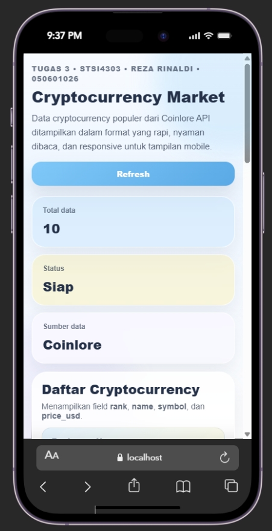

# Tugas 3 - STSI4303

## Preview UI
<p align="center">
  
</p>

## Identitas
- **Nama:** Reza Rinaldi
- **NIM:** 050601026
- **Prodi:** Sistem Informasi
- **UPJJ:** Surabaya

## Deskripsi Proyek
Aplikasi mobile sederhana berbasis **Ionic Vue** untuk menampilkan data cryptocurrency dari **Coinlore API**.

Aplikasi menampilkan informasi cryptocurrency populer secara real-time dengan tampilan modern, responsif, dan mobile-friendly menggunakan konsep UI pastel, glassmorphism, serta card-based layout.

## Fitur
- Mengambil data cryptocurrency dari API online Coinlore
- Menampilkan informasi:
  - `rank`
  - `name`
  - `symbol`
  - `price_usd`
- Tombol **Refresh Data**
- Menampilkan total data cryptocurrency
- Status proses pengambilan data
- Tampilan responsif untuk perangkat mobile maupun desktop
- Layout modern dan mudah dibaca

## API Endpoint
https://api.coinlore.net/api/tickers/

## Teknologi yang Dipakai
- Ionic Vue
- Vue 3 + TypeScript
- Axios
- Coinlore API
- CSS Grid & Flexbox

## Teknik CSS Modern
- Responsive Design
- Pastel Color Palette
- Glassmorphism Soft UI
- Card-Based Layout
- Gradient & Box Shadow
- Hover Animation
- Mobile First Design

## Struktur Data yang Ditampilkan

| Field | Keterangan |
|---|---|
| `rank` | Peringkat cryptocurrency |
| `name` | Nama cryptocurrency |
| `symbol` | Simbol cryptocurrency |
| `price_usd` | Harga cryptocurrency dalam USD |

## Cara Menjalankan Project

```bash
npm install
ionic serve
